# Gestor de E-commerce de tienda de ropa

### indice 

- [Descripción](#descripción)
- [Tecnologías](#tecnologías)
- [Pantalla de inicio](#pantalla-de-inicio)
- [Detalles de Producto](#detalles-de-producto)
- [Edición de Producto](#edición-de-producto)
- [Agregar Imágenes a un Producto](#agregar-imágenes-a-un-producto)
- [Creación de Producto](#creación-de-producto)

## Descripción

Este proyecto es una aplicación móvil desarrollada con [React Native](https://reactnative.dev/) que permite visualizar y editar el catálogo de un e-commerce de una tienda de ropa. La aplicación consume un backend local y permite realizar las siguientes acciones:

- Visualizar la lista de productos disponibles.
- Visualizar los detalles de un producto tales como: nombre, precio, descripción, stock, tallas disponibles, género y las imágenes del producto.
- Editar todos los campos de un producto y guardar los cambios  a través de un botón.
- Agregar imágenes disponibles en la galería del dispositivo a un producto.
- Crear un nuevo producto con todos los campos necesarios y agregar imágenes disponibles en la galería del dispositivo.

## Tecnologías

<table>
   <thead>
      <tr>
         <th>Tecnologías</th>
         <th></th>
      </tr>
   </thead>
   <tbody>
      <tr>
         <td><a href="https://reactnative.dev/">React Native</a></td>
         <td></td>
      </tr>
      <tr>
         <td><a href="https://reactnavigation.org/">React Navigation</a></td>
         <td></td>
      </tr>
      <tr>
         <td><a href="https://akveo.github.io/react-native-ui-kitten/">UI Kitten 5.3</a></td>
         <td></td>
      </tr>
      <tr>
         <td><a href="https://axios-http.com/">Axios</a></td>
         <td></td>
      </tr>
      <tr>
         <td><a href="https://tanstack.com/query/latest">TanStack Query</a></td>
         <td></td>
      </tr>
      <tr>
         <td><a href="https://www.typescriptlang.org/">TypeScript</a></td>
         <td></td>
      </tr>
      <tr>
         <td><a href="https://formik.org/">Formik</a></td>
         <td></td>
      </tr>
      <tr>
         <td><a href="https://zustand-demo.pmnd.rs/">Zustand</a></td>
         <td></td>
      </tr>
   </tbody>
</table>

## Pantalla de inicio

La pantalla de inicio muestra las tarjetas de los productos disponibles en el catálogo en dos columnas. Cada tarjeta muestra la imagen del producto y su nombre.

 
   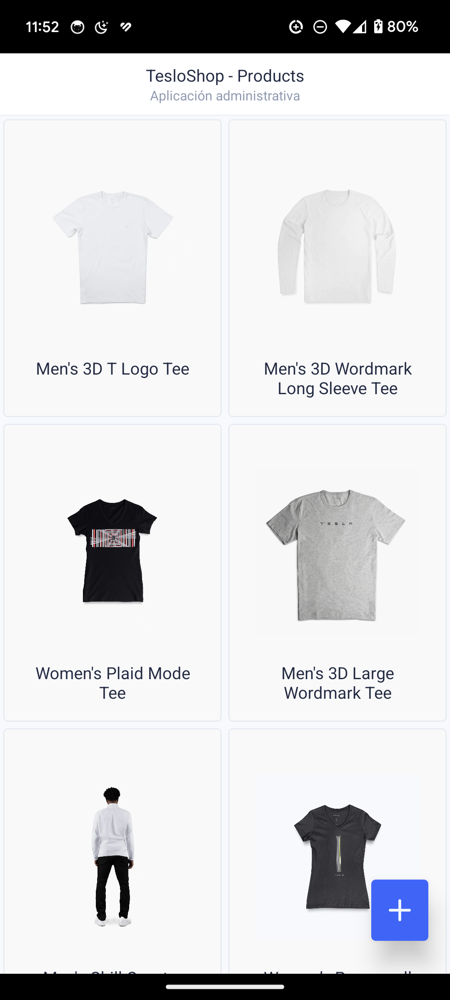
   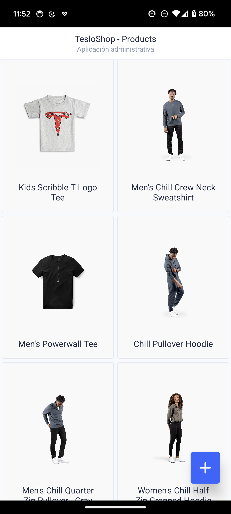
   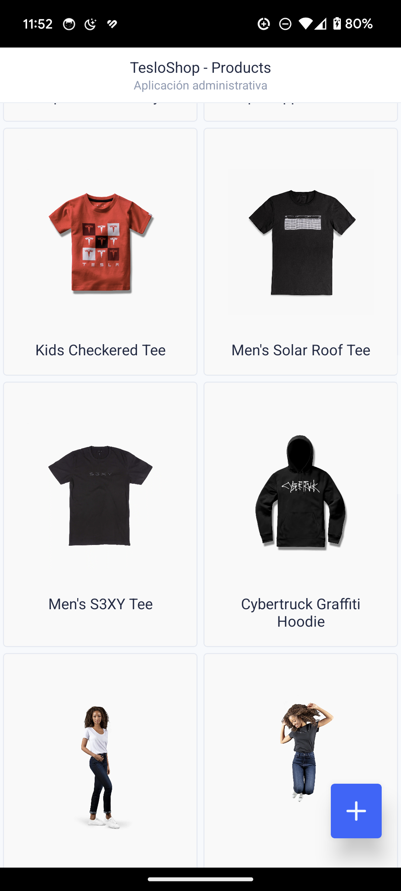

## Detalles de Producto

Esta pantalla muestra los detalles de un producto en específico. Todo está distribuido en una sola columna y sigue los estilos definidos por el tema de UI Kitten. 

 
   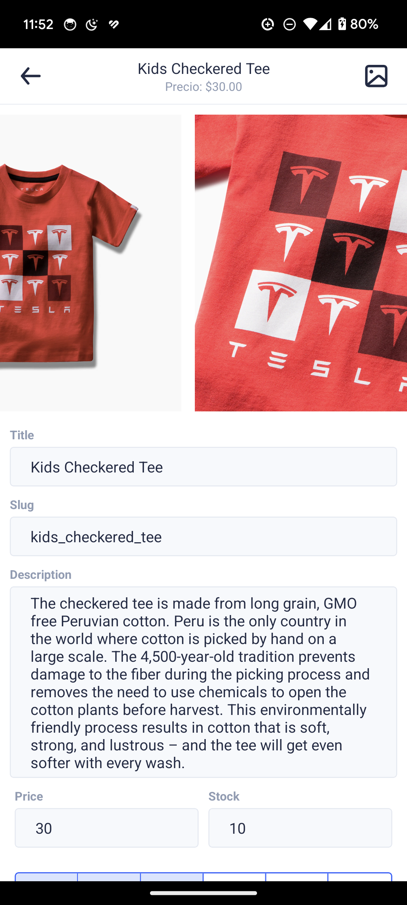
   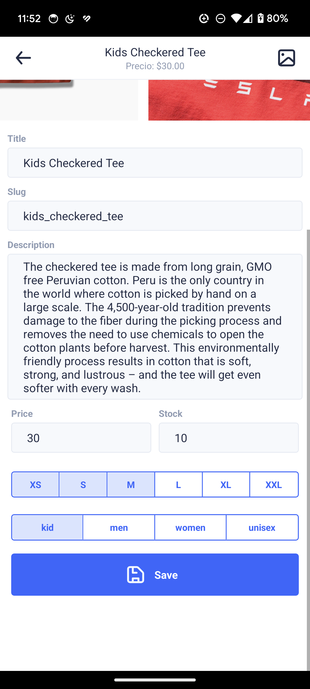
   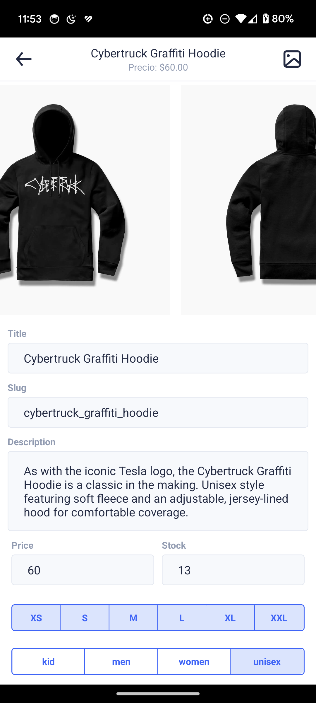

## Edición de Producto

Toda la información de un producto puede ser editada cuando entras a ver sus detalles, solamente debes presionar el botón de guardar para que los cambios se guarden en el backend y la información sea actualizada.

 
   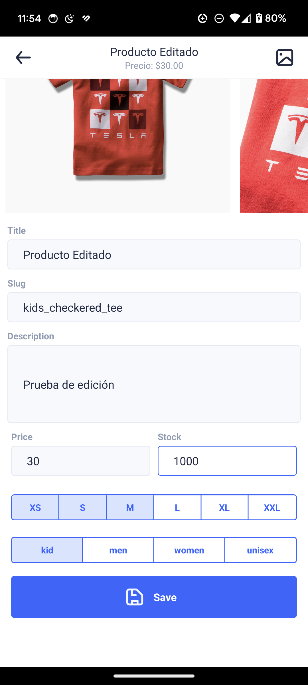
   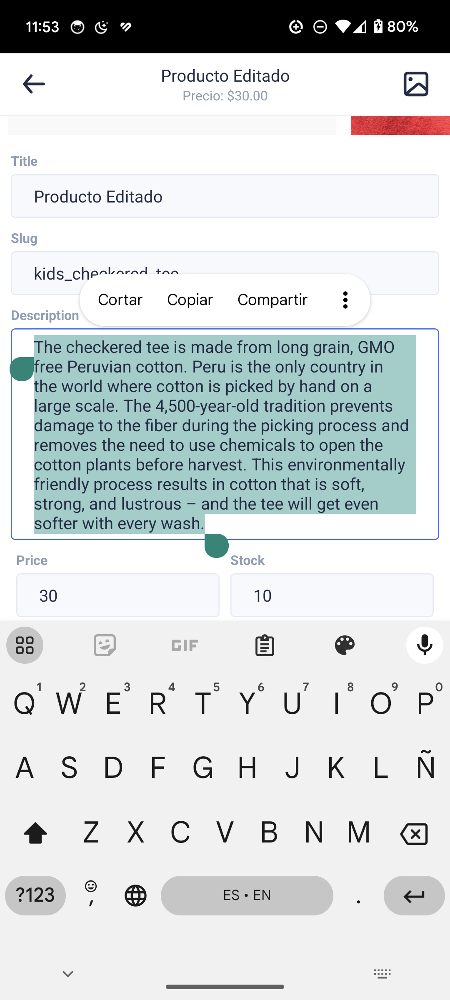
   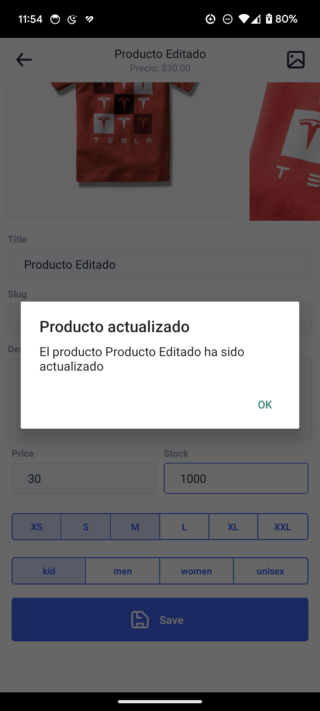

## Agregar Imágenes a un Producto

La aplicación permite agregar imágenes a un producto desde la galería del dispositivo. Al presionar el ícono de foto en la parte superior derecha de la pantalla de detalles, se abre la galería del dispositivo y se pueden seleccionar hasta 10 imágenes. 

 
   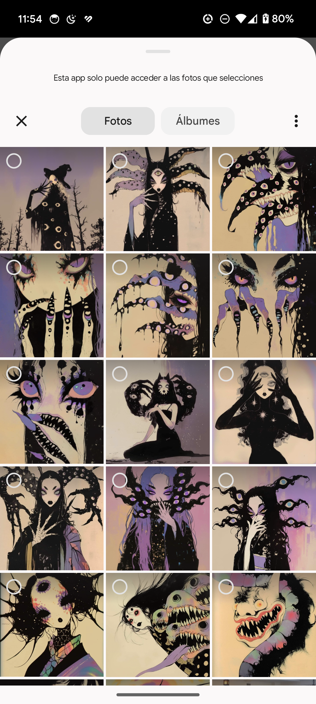
   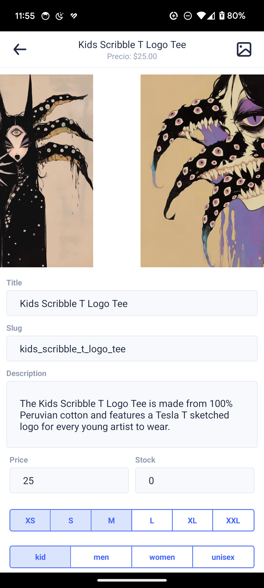

## Creación de Producto

Al presionar el FAB (Floating Action Button) en la pantalla de inicio, se abre una pantalla que permite crear un nuevo producto. Todos los campos son requeridos y se pueden agregar hasta 10 imágenes desde la galería del dispositivo. Al final el producto se guarda en el backend y se muestra en la pantalla de inicio.

 
   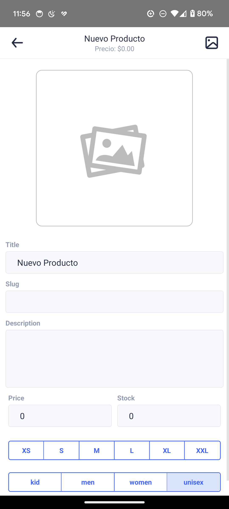
   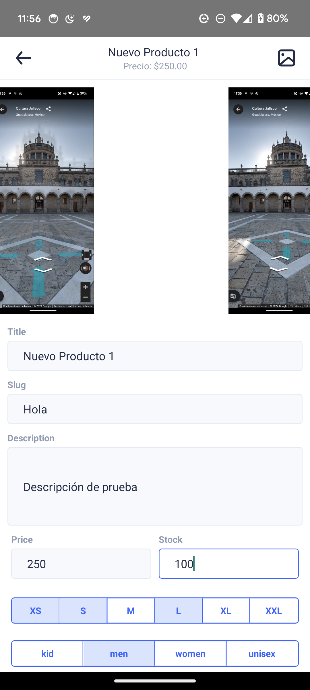
   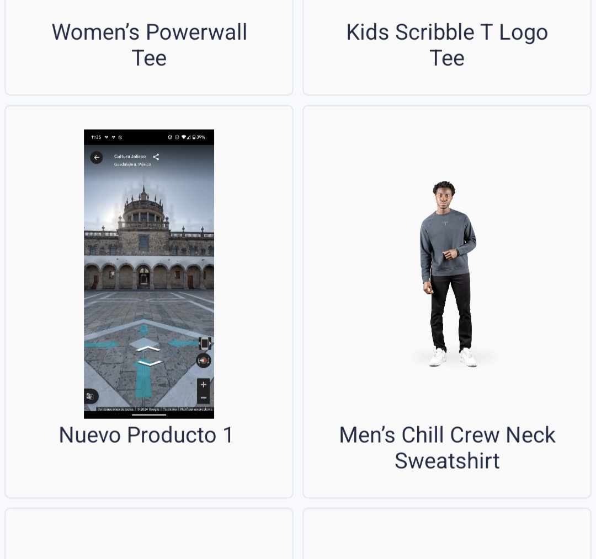

